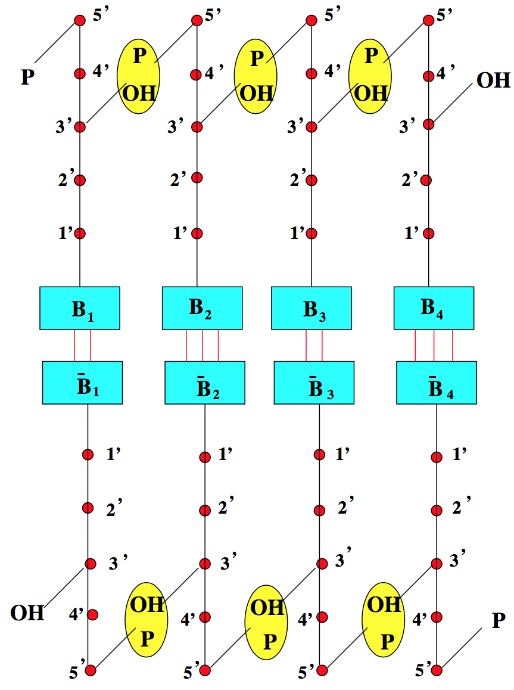
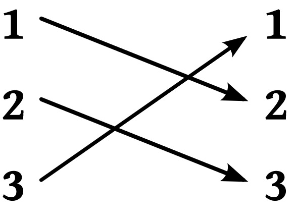
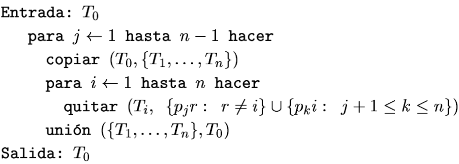
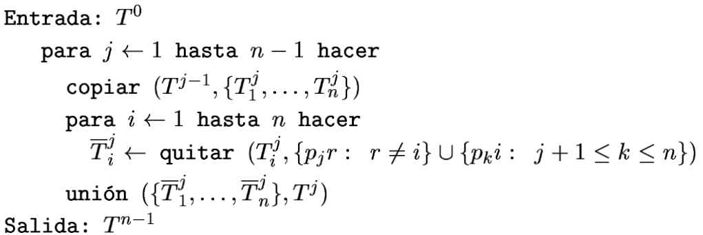
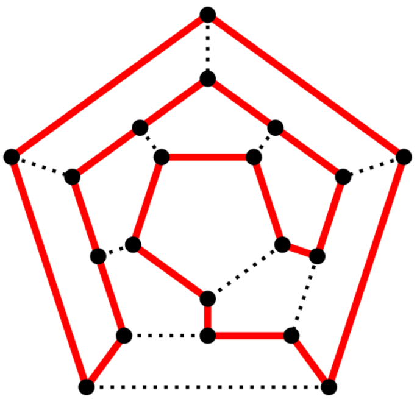
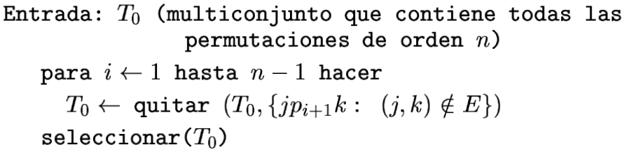
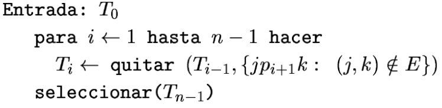

Computación molecular sin memoria basada en ADN
===

#####  Problemas de generación de permutaciones y camino hamiltoniano

###### Sergio Rodríguez Calvo, Septiembre 2017. 
###### Computación Bioinspirada (MULCIA), Universidad de Sevilla.

---

# ADN

---

# Computación Molecular

- Tubo de ensayo contiene una solución con cadenas simples de ADN (oligos).
- Automatización de procesos sobre los tubos que realizan operaciones abstractas, tales como, medir, sumar, etc.
- Necesario un modelado y representación del problema adecuado para este tipo de computación.

---

# Operaciones con moléculas de ADN

Algunos ejemplos de operaciones son:

- Desnaturalización: separar doble hebra calentando solución hasta un rango de 85ºC - 95ºC.
- Extracción: extraer de un tubo todas las moléculas que contienen una determinada subcadena, utilizando el método de las sondas metálicas.
- Cortar cadenas: uso de enzimas endonucleasas que cortan cadenas (simples o dobles) por cualquier sitio.

---

# Modelo débil de Amos

- Tubo de ensayo con un multiconjunto finito de cadenas con alfabeto `{A,C,G,T}`.
- Operaciones en el modelo débil de Amos (primitivas) son:
  - `Quitar(T,{s1,...,sn})`.
  - `Copiar(T,{T1,...,Tn})`.
  - `Unión({T1,...,Tn})`.
  - `Selección(T)`.

---

# Problema de la generación de permutaciones

- Permutación: 

- Problema: _dado un numero natural n mayor o igual que 2, generar todas las permutaciones de orden n_.

---

# Diseño molecular

- Alfabeto `(pi,cj)` para todo `i,j` entre `[1,n]`.
- Dado un tubo de entrada `T0` que contiene todas las posibles sucesiones:

---

# Previo a la verificación formal

- Buscar una fórmula que cumpla (p. corrección y completitud):
    - Fórmula es verdadera antes de comenzar el bucle.
    - Fórmula es invariante en dicho bucle (por inducción débil).
- Reetiquetado.
- Corrección del programa (Teorema + Corolario).
- Completitud del programa (Teorema + Corolario).

---

# Verificación formal

- Se reescribe el código para enumerar los tubos:

* _Ver documento_.

---

# Problema del camino hamiltoniano

---

# Diseño molecular

- Alfabeto `(pi,cj)` para todo `i,j` entre `[1,n]`.
- Dado un tubo de entrada `T0` que contiene todas las posibles sucesiones:

---

# Verificación formal

- Se reescribe el código para enumerar los tubos:

* _Ver documento_.

---

# Gracias

---